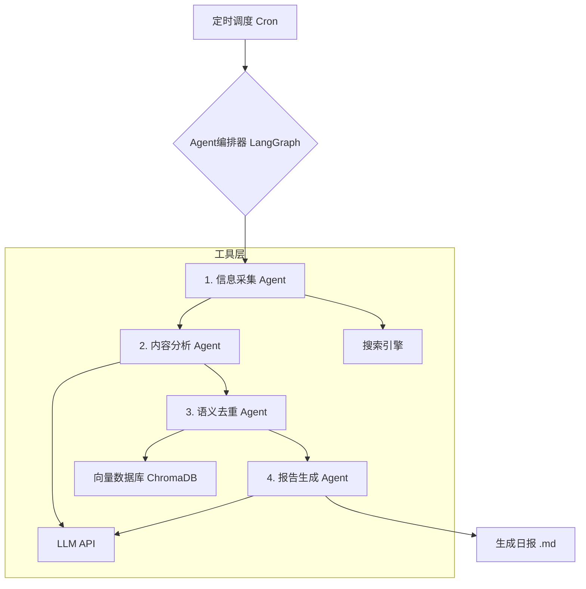

# 每日AI与机器人技术进展智能体

这是一个基于Agent开发思路实现的智能体，旨在每日自动收集、分析、整理最新的AI与机器人技术进展，并生成一份结构化的日报。

## ✨ 功能特性

- **全网信息采集**：通过搜索引擎关键词抓取全网最新的技术资讯，确保信息来源的广泛性。
- **智能内容分析**：利用大语言模型（LLM）对内容进行深度分析，评估技术价值、相关性和新鲜度，并自动进行分类。
- **语义去重**：内置向量数据库（ChromaDB），对内容进行语义级别的去重，确保日报内容的独特性和高价值。
- **自动化报告生成**：自动生成包含**技术分类**、**趋势分析**、**前沿洞察**和**方向预测**的结构化Markdown报告。
- **幽默点评**：为每条资讯生成一句简洁幽默的点评，增加报告的可读性和趣味性。
- **高度可配置**：所有关键参数（如LLM模型、搜索关键词、分类标准等）均可通过配置文件进行调整。
- **定时自动运行**：可配合Linux Cron实现每日定时自动运行，无需人工干预。

## 🏛️ 技术架构

本项目采用基于LangGraph的Agent编排架构，将整个任务流程拆分为四个独立的Agent，协同完成日报的生成。



- **Agent编排器 (Orchestrator)**：基于`LangGraph`实现，负责定义和执行整个工作流，调度各个Agent按顺序工作。
- **信息采集Agent (Collector)**：负责根据关键词从Google等搜索引擎爬取最新的新闻资讯。
- **内容分析Agent (Analyzer)**：调用LLM对收集到的信息进行质量评分和分类，过滤掉低价值内容。
- **语义去重Agent (Deduplicator)**：将高质量内容向量化，并存入ChromaDB。通过计算语义相似度，过滤掉与历史内容重复的资讯。
- **报告生成Agent (Reporter)**：将最终筛选出的独特资讯整理成结构化的Markdown报告，并调用LLM生成趋势分析、洞察和预测。

## 🚀 快速开始

您可以在本地的Ubuntu 22.04系统上轻松部署和运行此智能体。

### 1. 环境准备

确保您的系统已安装`Python 3.11+`和`git`。

```bash
sudo apt update
sudo apt install python3.11 python3.11-venv git -y
```

### 2. 下载项目

将本项目代码克隆到您的本地电脑。

```bash
git clone <your-repo-url> ai_robot_daily_agent
cd ai_robot_daily_agent
```

*(注：此处`<your-repo-url>`应替换为实际的代码仓库地址。在当前环境下，您可以直接使用我们已为您准备好的文件。)*

### 3. 创建并激活Conda环境

我们使用Conda来管理项目环境。

```bash
conda create -n daily_agent python=3.11 -y
conda activate daily_agent
```

### 4. 安装依赖

```bash
pip install -r requirements.txt
```

### 5. 配置API密钥

本项目使用阿里百炼（DashScope）API。请在终端中设置您的API密钥。

```bash
export DASHSCOPE_API_KEY="sk-??"
```

**重要提示**：为了长期使用，建议将此行命令添加到您的`~/.bashrc`或`~/.zshrc`文件中，然后执行`source ~/.bashrc`使其生效。

### 6. 运行Agent

一切准备就绪！执行以下命令即可开始生成您的第一份技术日报。

```bash
./main.py
```

运行成功后，您将在`reports`目录下找到生成的Markdown格式日报文件，例如`reports/ai_robot_daily_20260106.md`。

## ⚙️ 自动化调度

要实现每日自动运行，您可以使用Linux的`cron`服务。

1.  **编辑Cron任务**

    ```bash
    crontab -e
    ```

2.  **添加定时任务**

    在打开的文件末尾添加以下一行，设置任务在每天早上8点运行：

    ```cron
    0 8 * * * /usr/bin/bash /home/ubuntu/ai_robot_daily_agent/run.sh >> /home/ubuntu/ai_robot_daily_agent/logs/cron.log 2>&1
    ```

    *(请确保上面的路径`/home/ubuntu/ai_robot_daily_agent/`与您的实际项目路径一致)*

3.  **创建`run.sh`脚本**

    在项目根目录下创建一个名为`run.sh`的脚本文件，用于设置环境变量并执行主程序。

    ```bash
    #!/bin/bash
    
    # 切换到项目目录
    cd /home/ubuntu/ai_robot_daily_agent || exit
    
    # 设置API密钥
    export DASHSCOPE_API_KEY="sk-YourActualDashScopeKey"
    
    # 激活Conda环境
    source $(conda info --base)/etc/profile.d/conda.sh
    conda activate daily_agent
    
    # 运行主程序
    python main.py
    
    # 退出环境
    conda deactivate
    ```

4.  **为脚本添加执行权限**

    ```bash
    chmod +x run.sh
    ```

现在，您的智能体将在每天早上8点自动为您生成最新的技术日报。

## 🔧 自定义配置

您可以根据自己的需求，通过修改`config/config.yaml`文件来定制Agent的行为。

- **LLM配置 (`llm`)**: 更换不同的GPT模型，如`gpt-4.1-nano`以降低成本，或调整`temperature`来改变生成内容的创造性。
- **搜索关键词 (`sources.keywords`)**: 添加或修改关键词，以拓宽或聚焦信息采集的范围。
- **分类标准 (`categories`)**: 自定义您关心的技术领域，Agent会自动按照新的分类标准进行整理。
- **内容过滤 (`filtering`)**: 调整`min_quality_score`（最低质量分）和`similarity_threshold`（去重相似度）来控制内容的质量和独特性。

## 📁 项目结构

```
.ai_robot_daily_agent/
├── agents/               # Agent模块
│   ├── __init__.py
│   ├── analyzer.py       # 内容分析Agent
│   ├── collector.py      # 信息采集Agent
│   ├── deduplicator.py   # 语义去重Agent
│   ├── orchestrator.py   # Agent编排器
│   └── reporter.py       # 报告生成Agent
├── config/               # 配置文件
│   └── config.yaml
├── data/                 # 数据存储
│   ├── chroma_db/        # 向量数据库
│   └── history.db        # 历史记录数据库
├── logs/                 # 日志文件
│   └── agent.log
├── reports/              # 生成的报告
│   └── example_report.md
├── utils/                # 工具函数
│   ├── __init__.py
│   └── state.py          # Agent状态定义
├── main.py               # 主程序入口
├── requirements.txt      # Python依赖
├── run.sh                # Cron执行脚本
└── README.md             # 本文档
```
